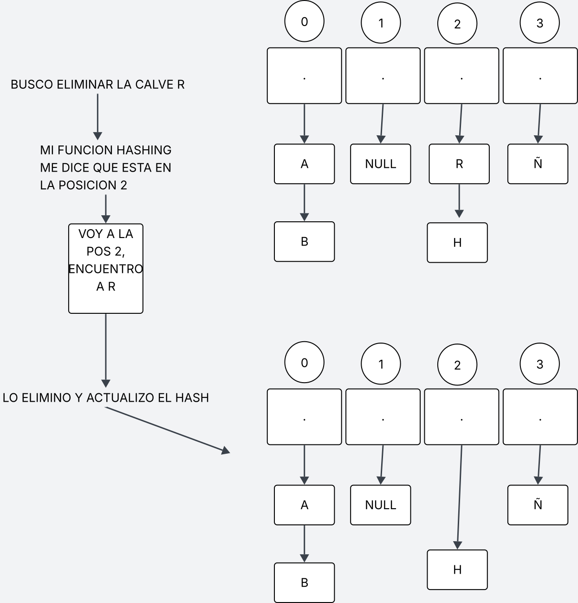
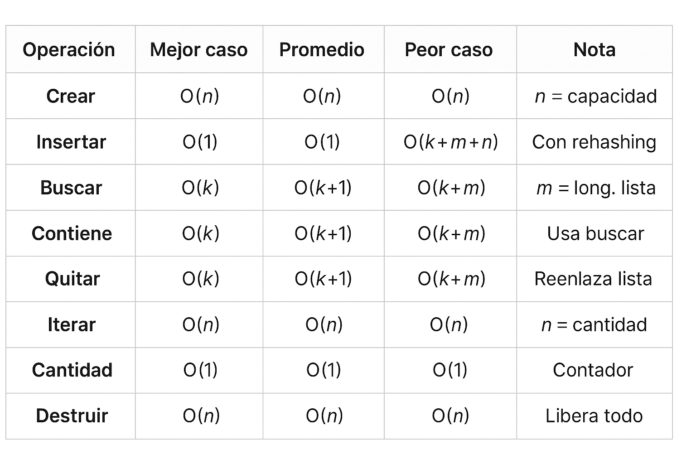
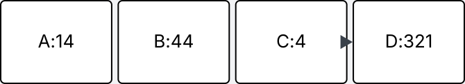
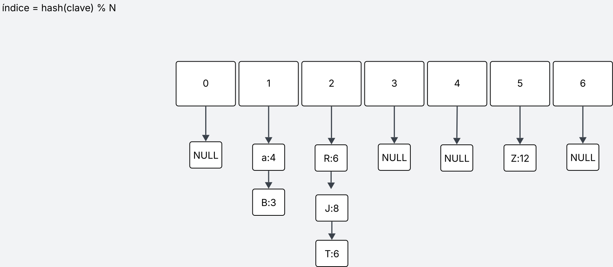
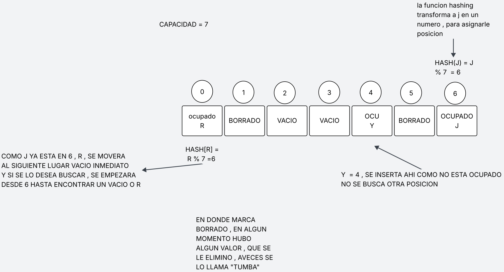
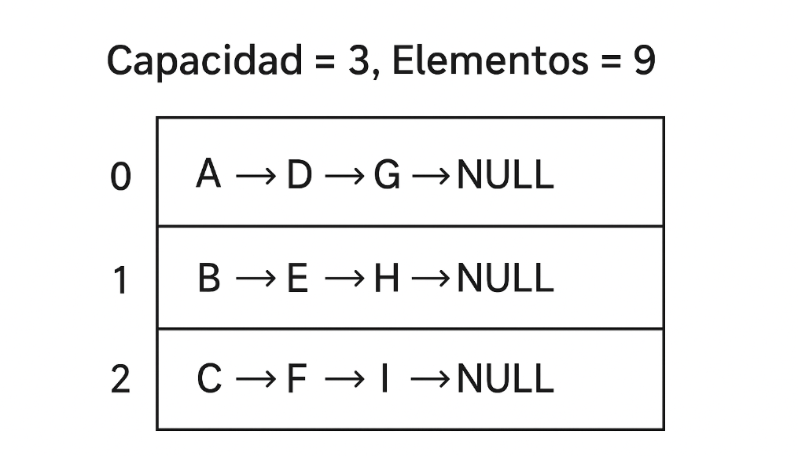
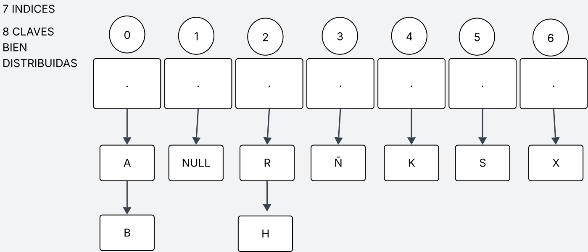

<div align="right">

</div>

# TDA HASH

## Repositorio de JERONIMO PEREZ CORDOBA - 111939 - JEROPEREZ42@GMAIL.COM - JEPEREZC@FI.UBA.AR

- Para compilar:

```
make 
```

- Para ejecutar pruebas_alumno:

```
./pruebas_alumno
```

- Para ejecutar con valgrind:
```
valgrind --leak-check=full --track-origins=yes --show-reachable=yes --error-exitcode=2 --show-leak-kinds=all --trace-children=yes ./pruebas_alumno
```
---


##  Funcionamiento

### Estructura de Datos: Tabla de Hash

direccionamiento cerrado con resolución de colisiones por encadenamiento 

### Función de Hash: DJB2

Utilizamos la función **djb2** (Daniel J. Bernstein, 1991), una de las más eficientes para strings:

**¿Por qué djb2?**
- **5381**: Número primo inicial para mejor distribución
- **hash << 5**: Desplazamiento de 5 bits (multiplicar por 32)
- **hash * 33**: El número 33 fue elegido empíricamente por producir pocas colisiones
- Excelente distribución estadística para nombres, palabras y URLs


### Primitivas y Complejidad:

#### 1. 'hash_crear()'
**Complejidad:  O(n)  porque calloc inicializa todo el array **

- Reserva memoria para el array de punteros
- Inicializa todas las posiciones en NULL (aqui se da el O(N))
- Capacidad mínima: 3 posiciones


---


### 2. 'hash_insertar()'
**Complejidad: O(1) promedio, O(k+m) peor caso**

Donde:
- k = longitud de la clave
- m = longitud de la lista en esa posición

1. Calcula el índice: indice = hash(clave) % capacidad → O(k)
2. Busca la clave en la lista del índice → O(m)
3. Si existe: reemplaza el valor
4. Si no existe: inserta al inicio de la lista → O(1)
5. Rehashing si factor de carga > 0.75 → O(n)

**Factor de carga = cantidad / capacidad**
- Cuando supera 0.75, redimensiona al doble
- Mantiene listas cortas → O(1) promedio

---

#### 3. 'hash_buscar()'
**Complejidad: O(1) promedio, O(k+m) peor caso**

1. Calcula índice → O(k)
2. Recorre la lista en 'tabla[indice]' comparando claves → O(m)
3. Con buen factor de carga, m es pequeño (1-2 elementos promedio)

---

#### 4. 'hash_contiene()'
**Complejidad: O(1) promedio, O(k+m) peor caso**

- Internamente usa hash_buscar
- Devuelve true si encuentra la clave


---
#### 5. 'hash_quitar()'
**Complejidad: O(1) promedio, O(k+m) peor caso** 
(k: La longitud de la clave . Calcular el hash y comparar claves requiere recorrer todos los caracteres de la clave, por eso es O(k)

m: La cantidad de elementos en la lista del bucket . Si muchas claves colisionan y caen en la misma posición, hay que recorrer toda la lista para buscar, insertar o eliminar, por eso es O(m). )


1. Calcula índice → O(k)
2. Busca el nodo en la lista → O(m)
3. modificA el puntero del nodo anterior para que apunte al siguiente nodo
4. Libera la clave 
5. Devuelve el valor 



---


#### 6. 'hash_iterar()'
**Complejidad: O(n)** donde n = cantidad de elementos

- Recorre el array completo → O(capacidad)
- Por cada posición, recorre la lista 
- Con buen factor de carga: O(cantidad)


---

#### 7. 'hash_cantidad()'
**Complejidad: O(1)**

- Devuelve el contador interno


---


#### 8. 'hash_destruir()' y 'hash_destruir_todo()'
**Complejidad: O(n)**  donde n = cantidad de elementos

- Recorre cada posición del array → O(capacidad)
- Por cada lista, libera todos los nodos 
- `hash_destruir_todo`: aplica destructor a cada valor


---
---



---

### En cuanto al main

En mi implementación, el programa recibe por línea de comandos el nombre de un archivo de pokemones y utiliza las primitivas del TP1 para cargar los datos en una tabla de hash. La tabla de hash se construye usando el nombre del pokemon como clave, ya que las primitivas y la estructura del TDA hash están diseñadas para trabajar con claves tipo string.

La busqueda de pokemones , por nombre, se realiza con una complejidad O(1) , pero la busqueda por ID , no aprovecha al hash , ya que el ID , no es posible  traducirlo mediante la funcion hashing porque esta recibe 'funcion_hashing(const char *str, size_t capacidad)', por lo tanto para buscar un id , hay que recorrer clave por clave hasta encontrarlo generando un 0(N).

---


## Respuestas a las preguntas teóricas

### 1. ¿Qué es un diccionario?

Un **diccionario** (o mapa/tabla asociativa) es una estructura de datos que almacena pares **clave-valor**, permitiendo:
- **Insertar** un valor asociado a una clave
- **Buscar** un valor por su clave
- **Eliminar** un par clave-valor

**Características:**
- Las claves son **únicas** (no hay duplicados)
- Acceso eficiente por clave (idealmente O(1))
- No mantiene orden , a menos que se lo pida

**Ejemplo conceptual:**

Diccionario de edades:
"Juan"    → 11
"María"   → 23
"Pedro"   → 100


---


### 2. Tres formas de implementar un diccionario

**Array ordenado + Búsqueda binaria**



---

**Skip List**

Una estructura probabilística que permite búsquedas, inserciones y eliminaciones en O(log n) 
¿Cómo funciona?
Es una lista enlazada ordenada con varios niveles.
El nivel más bajo (nivel 1) contiene todos los elementos.
Cada nivel superior contiene algunos elementos (saltos), permitiendo "saltar" más rápido por la lista.


Level 3:  ----A-------------F---------
Level 2:  ----A----C--------F---------
Level 1:  A--B--C--D--E--F--G----------


Para buscar un elemento, empezás en el nivel más alto y avanzás hasta que el siguiente elemento es mayor al que buscás.
Bajás un nivel y seguís buscando.
Así, vas "saltando" grandes bloques y luego refinando la búsqueda en niveles más bajos.


---

#### **Tabla de Hash** (nuestra implementación)



**Ventaja:** Operaciones más rápidas O(1)  
**Desventaja:** No mantiene orden, usa más memoria

---


### 3. ¿Qué es una función de hash?

Una **función de hash** transforma una clave (de tamaño arbitrario) en un índice numérico (tamaño fijo) dentro del rango de la tabla.


   funcion_hash("Pikachu", capacidad=10) → 7
   funcion_hash("Charizard", capacidad=10) → 2
   funcion_hash("Bulbasaur", capacidad=10) → 5

**Características deseables:**

1. **Determinística:**  
   Misma entrada → misma salida siempre  
   `hash("Pikachu")` siempre da el mismo resultado

2. **Distribución uniforme:**  
   Minimizar colisiones  
   Distribuir claves uniformemente en la tabla

3. **Eficiencia:**  
   Cálculo rápido O(k), k = longitud de clave  
   No debe ser más lento que las operaciones del hash

4. **Efecto avalancha:**  
   Pequeños cambios → grandes diferencias en el hash  
   `hash("Pikachu") ≠ hash("Pikacho")`

**Para nuestro problema (strings como claves):**
- Debe procesar cada carácter
- Aprovechar todos los bits del resultado
- Minimizar patrones en strings comunes

**DJB2 cumple todas estas características**, por eso la elegí.

---

### 4. Tabla de Hash y métodos de resolución de colisiones

Una **tabla de hash** es un array donde cada posición se calcula mediante una función de hash.  
Una **colisión** ocurre cuando dos claves diferentes producen el mismo índice:


   hash("Pikachu") = 5
   hash("Raichu") = 5  ← Colisión!

#### Métodos de resolución:

##### Encadenamiento

**Hash Abierto = Direccionamiento Cerrado**  
Cada posición tiene una **lista enlazada**
- Múltiples elementos en la misma posición
- **Ventaja:** Simple, no hay "tabla llena", eliminación fácil
- **Desventaja:** Allocations extra, peor caché

##### Hash Cerrado = Direccionamiento Abierto

- Busca la siguiente posición libre: `(indice + 1) % capacidad`
- **Ventaja:** Mejor caché, menos memoria, array contiguo
- **Desventaja:** Agrupamiento, necesita marca "BORRADO", puede llenarse

Problema del BORRADO:

Inserta A en 5, B colisiona → 6
Elimina A → marca 5 como BORRADO (no VACÍO)
Busca B → empieza en 5 (BORRADO) → continúa → encuentra B en 6 ✓

Si marcara VACÍO:
Busca B → empieza en 5 (VACÍO) → para → NO encuentra B ✗



##### Sondeo cuadrático (Quadratic Probing)


   indice + 1², indice + 2², indice + 3², ...

- Evita agrupamiento del sondeo lineal
- Salta más posiciones
- Más complejo de implementar

##### Doble hash (Double Hashing)


   indice = (hash1(clave) + i * hash2(clave)) % capacidad

- Usa dos funciones hash diferentes
- Mejor distribución
- Más cálculos, más complejo

---

### ¿Por qué es importante el tamaño de la tabla de hash?

El tamaño de la tabla es fundamental para el rendimiento de cualquier implementación de hash, tanto en tablas abiertas como en tablas cerradas.

#### Tablas cerradas

- Cada posición almacena un solo elemento.
- Si la tabla es muy pequeña, habrá muchas colisiones y las listas de sondeo serán largas.
- Esto degrada la complejidad de las operaciones de O(1) promedio a O(n) en el peor caso.
- Si la tabla es muy grande, se desperdicia memoria.

#### Tablas abiertas

- Cada posición puede almacenar una lista de elementos.
- Aunque siempre se puede insertar (no hay "tabla llena"), si la tabla es muy pequeña, las listas se hacen largas y la búsqueda se vuelve lenta.
- El tamaño adecuado mantiene las listas cortas y las operaciones en O(1) promedio.

---

### ¿Realmente importa el tamaño en una tabla abierta?

En una tabla abierta se pueden guardar infinitos elementos en cada posición usando listas, pero si la tabla es muy pequeña, las listas se hacen largas y la eficiencia se pierde.

**Ejemplo 1: Tabla pequeña (mal tamaño)**



**Ejemplo 2: Tabla grande (buen tamaño)**



**Conclusión:**  
Si el tamaño es pequeño, las listas crecen y la eficiencia baja a O(n).  
Un tamaño adecuado mantiene las listas cortas y las operaciones en O(1) promedio.